# EDA Summary

## Data Shape
Rows: 32593, Columns: 15

## Numeric Columns
['id_student', 'num_of_prev_attempts', 'studied_credits', 'date_registration', 'date_unregistration', 'module_presentation_length']

## Categorical Columns
['gender', 'final_result', 'age_band', 'highest_education', 'region', 'disability']

## Outlier Report
- id_student: 6460 outliers (19.82%), bounds=(304753.00, 848273.00)
- num_of_prev_attempts: 4172 outliers (12.80%), bounds=(0.00, 0.00)
- studied_credits: 350 outliers (1.07%), bounds=(-30.00, 210.00)
- date_registration: 339 outliers (1.04%), bounds=(-206.50, 77.50)
- date_unregistration: 41 outliers (0.13%), bounds=(-168.50, 275.50)
- module_presentation_length: 0 outliers (0.00%), bounds=(200.50, 308.50)

## Plots
- 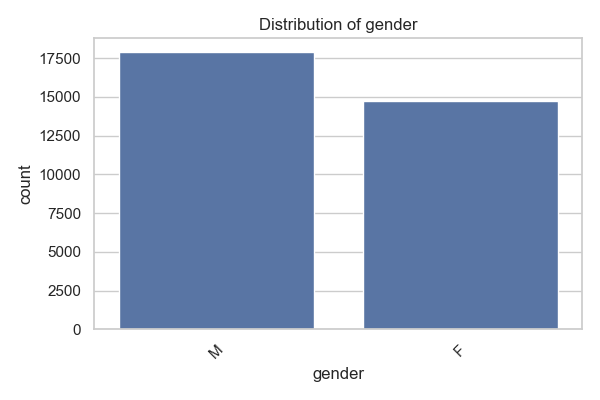
- 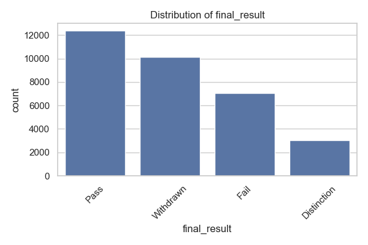
- 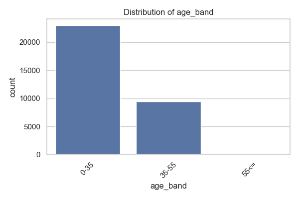
- 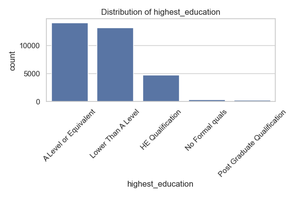
- 
- 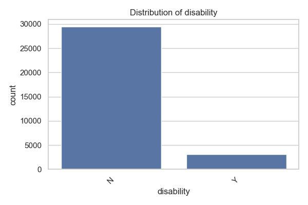
- 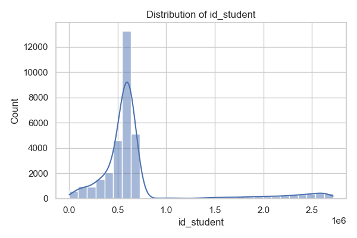
- 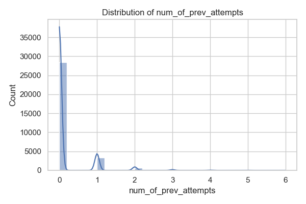
- 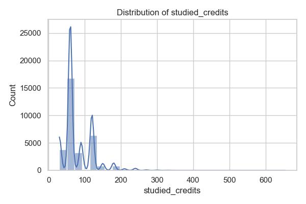
- 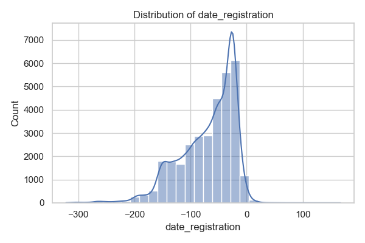
- 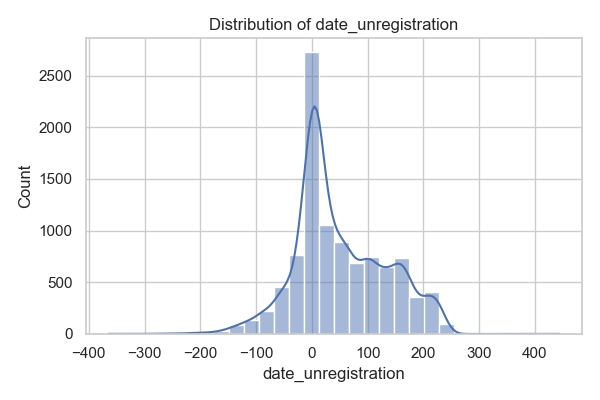
- 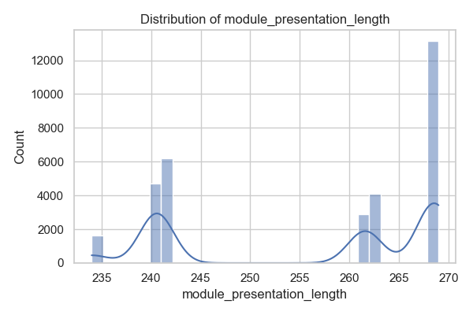
- 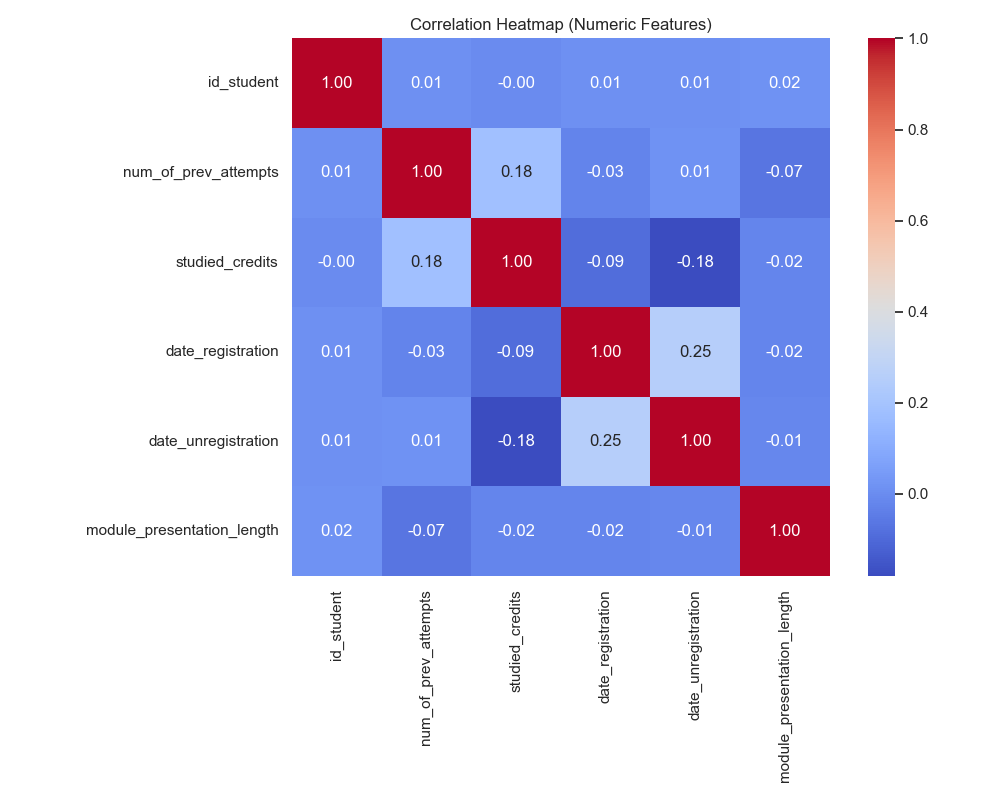
