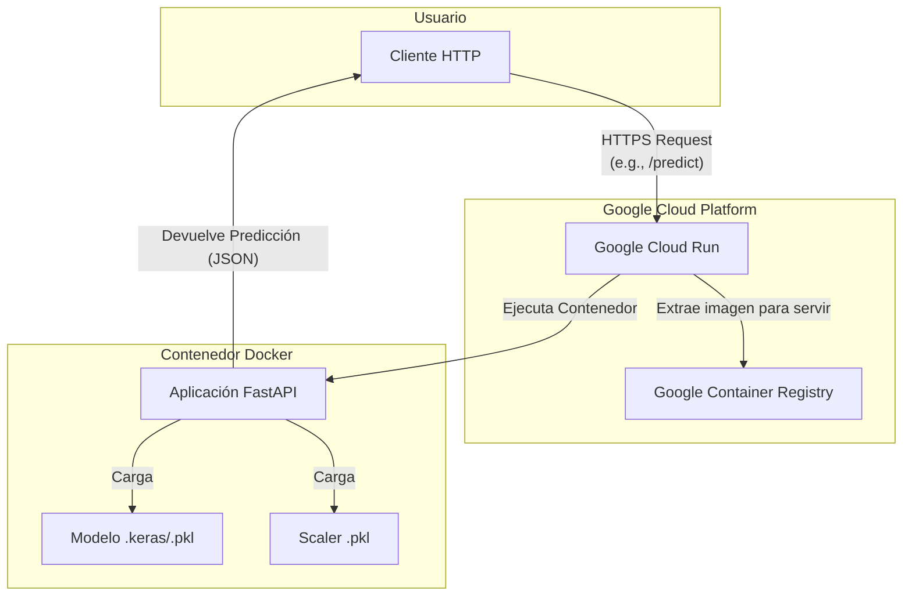

# Documentación de Despliegue del Modelo

Este documento detalla la infraestructura, el código y el proceso utilizados para desplegar el modelo de predicción de retención estudiantil en Google Cloud Platform.

## 1. Infraestructura

-   **Nombre del Modelo:** `student-retention-api` (en Google Cloud Run)
-   **Plataforma de Despliegue:** Google Cloud Run
-   **Registro de Contenedores:** Google Container Registry (GCR)
-   **Requisitos Técnicos:**
    -   Python 3.9
    -   Docker
    -   Google Cloud SDK (`gcloud` CLI)
    -   **Librerías Principales:** FastAPI, Uvicorn, Tensorflow/Keras, Scikit-learn, Pandas.
-   **Requisitos de Seguridad:**
    -   El servicio en Cloud Run está configurado para permitir acceso público no autenticado (`--allow-unauthenticated`) para fines de demostración.
    -   Todo el tráfico es servido a través de HTTPS, gestionado automáticamente por Google Cloud Run.

### Diagrama de Arquitectura



## 2. Código de Despliegue

-   **Archivo Principal:** `deployment/app.py` (Aplicación FastAPI)
-   **Contenerización:** `deployment/Dockerfile`
-   **Dependencias de la API:** `deployment/requirements.txt`
-   **Pruebas Automáticas:** `tests/test_api.py`
-   **Variables de Entorno:**
    -   `PORT`: Proporcionada automáticamente por Cloud Run para indicar en qué puerto debe escuchar la aplicación. El `Dockerfile` y `app.py` están configurados para usar esta variable.

## 3. Proceso de Despliegue (Resumen)

El despliegue se realiza mediante la construcción de una imagen de Docker y su subida a Google Cloud Run.

### Paso 1: Configurar el Entorno de GCP

```bash
# Iniciar sesión y seleccionar proyecto
gcloud init

# Habilitar las APIs necesarias
gcloud services enable run.googleapis.com
gcloud services enable containerregistry.googleapis.com

# Configurar Docker para autenticarse con GCR
gcloud auth configure-docker
```

### Paso 2: Construir y Subir la Imagen

(Reemplazar `[PROJECT_ID]` con el ID del proyecto y `[VERSION]` con la etiqueta deseada, ej. `v1`)

```bash
# Construir la imagen especificando la plataforma para evitar problemas de arquitectura
docker build --platform linux/amd64 -t gcr.io/[PROJECT_ID]/student-retention-api:[VERSION] -f deployment/Dockerfile .

# Subir la imagen a GCR
docker push gcr.io/[PROJECT_ID]/student-retention-api:[VERSION]
```

### Paso 3: Desplegar en Cloud Run

```bash
gcloud run deploy student-retention-api \
  --image gcr.io/[PROJECT_ID]/student-retention-api:[VERSION] \
  --platform managed \
  --region us-central1 \
  --allow-unauthenticated
```

## 4. Instrucciones de Uso

La API desplegada expone dos endpoints principales. La URL base del servicio es: `https://student-retention-api-493869234108.us-central1.run.app`

### GET /

-   **Descripción:** Verifica el estado de la API.
-   **Comando de Ejemplo:**
    ```bash
    curl https://student-retention-api-493869234108.us-central1.run.app
    ```
-   **Respuesta Esperada:**
    ```json
    {"status":"ok","model_loaded":true}
    ```

### POST /predict

-   **Descripción:** Realiza una predicción de abandono estudiantil.
-   **Payload (Cuerpo de la Petición):** Un objeto JSON con una clave `features`, que es una lista de 24 valores numéricos (flotantes o enteros).
-   **Comando de Ejemplo:**
    ```bash
    curl -X POST "https://student-retention-api-493869234108.us-central1.run.app/predict" \
    -H "Content-Type: application/json" \
    -d '{"features": [0.5, 1.2, -0.8, 2.1, 0.0, -1.5, 0.3, 1.8, -0.9, 0.1, 0, 0, 0, 0, 0, 0, 0, 0, 0, 0, 0, 0, 0, 0]}'
    ```
-   **Respuesta Esperada:**
    ```json
    {"prediction":0,"probability":0.1}
    ```
    *(Nota: Esta es la respuesta de la versión de prueba. Una versión con un modelo real devolverá predicciones reales).*

### Documentación Interactiva

-   Se puede acceder a una interfaz de Swagger UI (generada por FastAPI) para realizar pruebas interactivas en la URL: `https://student-retention-api-493869234108.us-central1.run.app/docs`

## 5. Mantenimiento y Troubleshooting

-   **Actualizar el Servicio:** Para desplegar una nueva versión del modelo o de la API, simplemente repita los Pasos 2 y 3 con una nueva etiqueta de versión (ej. `v7`). Cloud Run gestionará la transición del tráfico sin tiempo de inactividad.
-   **Ver Logs:** Los logs del contenedor se pueden visualizar en la consola de Google Cloud (Cloud Logging) para diagnosticar problemas. El enlace a los logs se proporciona en el output del comando `gcloud run deploy` si este falla.
-   **Problema Común (Arquitectura):** Si la construcción de la imagen se realiza en un Mac con chip Apple Silicon (ARM), es crucial usar la bandera `--platform linux/amd64` para asegurar la compatibilidad con Cloud Run.
-   **Problema Común (Timeout):** El error "container failed to start and listen on port" usualmente significa que la aplicación no está usando la variable de entorno `PORT` que Cloud Run le asigna.
